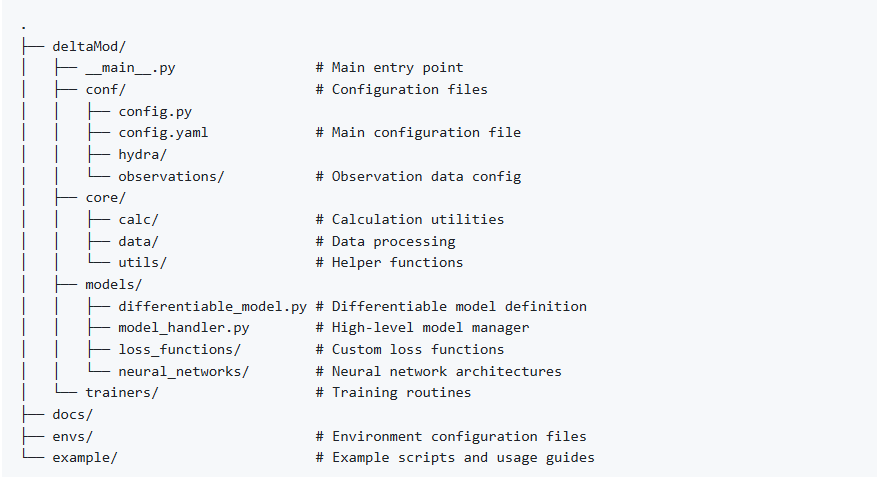
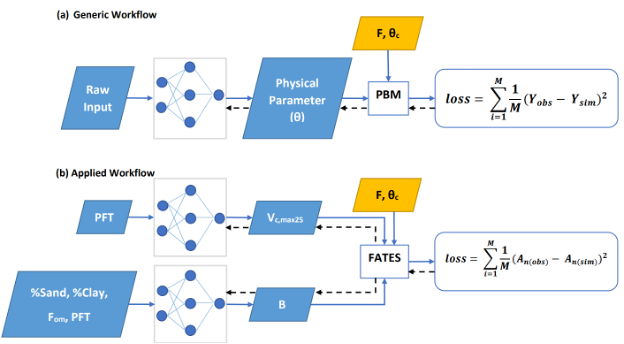
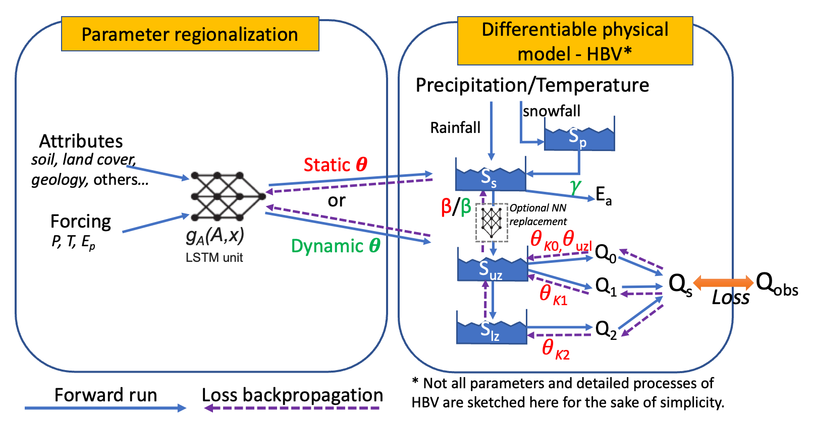
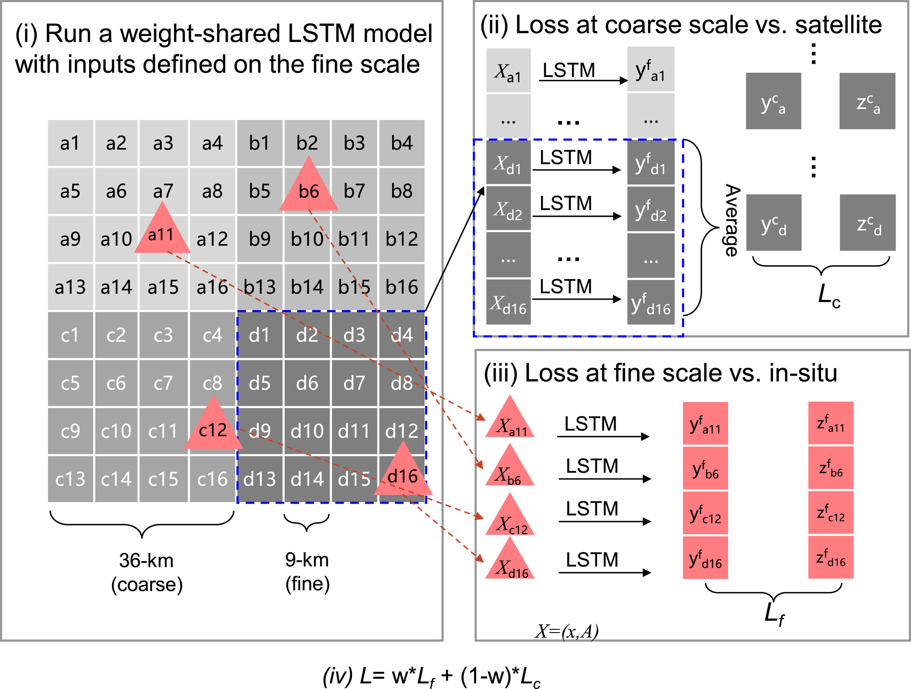
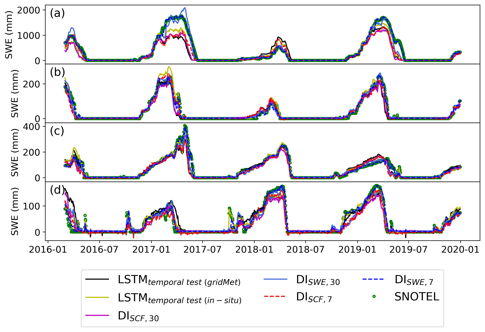

# Code 

See below for coding projects developed by the community that utilize HydroDL

### Differentiable Modeling Framework

  

-   [𝛿MG __(Lonzarich et al. 2024)__][lonzarich_2024.md]
    ---
{align="left" width="120"}
A second-generation generic, scalable differentiable modeling framework on PyTorch for integrating neural networks with physical models. Coupled with HydroDL2, 𝛿MG enables the hydrologic modeling like HydroDL while greatly expanding the range of applications and capabilities.

  

### Differentiable Models

  

-   [$\delta$ MC-Juniata-hydroDL2 __(Bindas et al. 2024)__][bindas_2023.md]

    ---
{align="left" width="120"}
A differentiable routing method that uses Muskingum-Cunge and an NN to infer parameterizations for Manning’s roughness

  

  

-   [$\delta$ differentiable stream temperature (LSTM + SNTEMP) __(Rahmani et al. 2023)__][Rahmani_et_al_2023.md]

    ---
{align="left" width="120"}
CONUS scale pearson correlation between baseflow estimation of our model and GAGES-II estimates of baseflow.

  

  

-   [diffEcosys __(Aboelyazeed_et_al_2023)__][Aboelyazeed_et_al_2023.md]

    ---
{align="left" width="120"}
A differentiable physics-informed ecosystem model 

  

  

-   [$\delta$ HBV-hydroDL __(Feng et al., 2022,2023)__][feng_2023.md]

    ---
{align="left" width="120"}
Differentiable hydrologic models using HBV model as a physical backbone.

  

  

-   [$\delta$ parameter learning __(Tsai_et_al_2021)__][Tsai_et_al_2021.md]

    ---
{align="left" width="120"}
Differentiable Parameter Learning

  

  

-   [Updated, simplified __$\delta$HBV tutorial__ for CAMELS streamflow] [tutorialdHBV]
  
    --- 
This notebook is a simplified $\delta$HBV code tutorial for CAMELS streamflow. Thanks to Yalan Song and Dapeng Feng. Note that different pytorch versions could lead to slightly different performances. 

  

### LSTM Models

  

-   [Starting point: Quick __LSTM tutorial__ on soil moisture prediction] [tutorial1]
  
    --- 
This notebook is the starting point for new people to learn hydrologic time series prediction using deep neural networks. You can see how CudnnLSTMmodel and CpuLSTM models are trained and how data are formatted. Dataset is embedded in the hydroDL library so it is easy to run the example.

  

  

-   [Updated, simplified __LSTM tutorial__ for CAMELS streamflow] [tutorial2]
  
    --- 
This notebook is the "high-flow expert" listed on the benchmark page. We greatly simplified the LSTM interface, making it easy to reuse this code on your data. This is slightly more involved than the soil moisture tutorial as we are dealing with a larger and more complex dataset. Thanks to Yalan Song, Kamlesh Sawadekar and Dapeng Feng. Note that different pytorch versions could lead to slightly different performances. 

  

  

-   [Multiscale __(Liu et al. 2022)__][liu_2022.md]

    --- 
{align="left" width="120"}
A multiscale DL scheme learning simultaneously from satellite and in situ data to predict 9 km daily soil moisture (5 cm depth). 

  

  

-   [LSTM for snow water equivalent __(Song et al. 2023)__][Song_SWE_2023.md]
   
    ---
{align="left" width="120"}
Time series of the forward model and the models integrating snow water equivalent (SWE) and snow cover fraction (SCF) at different time lags. 

  

  

-   [LSTM stream temperature model __(Rahmani et al. 2021)__][Rahmani_et_al_2021.md]
   
    ---
{align="left" width="120"}
CONUS scale aggregated metrics of stream temperature models for the testing time range considering observed, simulated, and no streamflow data among inputs,with a locally fitted auto-regressive model

  

### Transformer Models

  

-   [Transformer __(Liu et al. 2024)__][liu_2024.md]

    --- 
{align="left" width="120"}
First time Transformer achieved the same performance as LSTM on CAMELS dataset; LSTMs and Transformers are likely nearing the prediction limits of the dataset.

  

  [feng_2023.md]: ../codes/feng_2023.md
  [tutorialdHBV]: https://colab.research.google.com/drive/12sGKg-hy0o2s_2T8-9Yg47kZuliDvD1x#scrollTo=2ZJZDSlqrpFw
  [tutorial1]: https://colab.research.google.com/drive/1C4LIgMcqef3WxEd8TosLXP6tGD-CAXsJ
  [tutorial2]: https://bit.ly/47KqJHK
  [bindas_2023.md]: ../codes/bindas_2023.md
  [liu_2022.md]: ../codes/liu_2022.md
  [Song_SWE_2023.md]: ../codes/Song_SWE_2023.md
  [Rahmani_et_al_2021.md]: ../codes/Rahmani_et_al_2021.md
  [Aboelyazeed_et_al_2023.md]: ../codes/Aboelyazeed_2023.md
  [Tsai_et_al_2021.md]: ../codes/Tsai_2021.md
  [Rahmani_et_al_2023.md]: ../codes/Rahmani_et_al_2023.md
  [liu_2024.md]: ../codes/liu_2024.md
  [lonzarich_2024.md]: ../codes/lonzarich_2024.md
